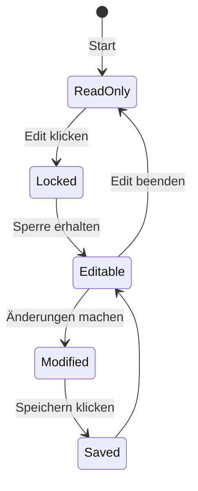

# TaskLibrary (Prozessvisualisierung)

Die TaskLibrary ist das zentrale Werkzeug zur grafischen Modellierung und Verwaltung Ihrer Aufgaben und Prozesse.

### Daten importieren
Sie können Daten auf zwei Arten in das System bringen:
*   **Import UseCase / Scenario (JSON)**: Lädt eine strukturierte Prozess-Datei im nativen Format (über den Settings-Button oben rechts).
    Das folgende Diagramm zeigt die möglichen hierarchischen Beziehungen von Prozesselementen. Die grau hinterlegten Prozesselemente **UseCase**, **Scenario** und **SubProzess** sind mögliche Wurzelknoten für eine als JSON Datei zu importierende Hierarchie von Prozesselementen. Die Hierarchie muss auf 2 Ebenen begrenzt sein - wobei die obere Ebene typischerweise **SubProcess** Elemente und die untere Ebene typischerweise **Event**, **Task** und **Rule** Elemente sind. Werden **UseCase** oder **Scenario** Elemente in die JSON Datei mit aufgenommen, sollen sie sich zusammen mit den **SubProcess** Elementen auf der oberen Ebene befinden. Der hierarchische Zusammenhang zwichen **UseCase** oder **Scenario** und **SubProcess** Elementen wird dann über **parent** Beziehungen realisiert.
    ```mermaid
    classDiagram
    direction TB
    class UseCase {
        <<GraphNode>>
        nodes : "GraphNode[0..*]"
        incoming : "GraphEdge[0..*]"
        outgoing : "GraphEdge[0..*]"
    }
    class Scenario {
        <<GraphNode>>
        nodes : "GraphNode[0..*]"
        incoming : "GraphEdge[0..*]"
        outgoing : "GraphEdge[0..*]"
    }
    class SubProcess {
        <<GraphNode>>
        nodes : "GraphNode[0..*]"
        incoming : "GraphEdge[0..*]"
        outgoing : "GraphEdge[0..*]"
    }
    class Event {
        <<GraphNode>>
        nodes : "GraphNode[0..*]"
        incoming : "GraphEdge[0..*]"
        outgoing : "GraphEdge[0..*]"
    }
    class Task {
        <<GraphNode>>
        nodes : "GraphNode[0..*]"
        incoming : "GraphEdge[0..*]"
        outgoing : "GraphEdge[0..*]"
    }
    class Rule {
        <<GraphNode>>
        nodes : "GraphNode[0..*]"
        incoming : "GraphEdge[0..*]"
        outgoing : "GraphEdge[0..*]"
    }
    UseCase --> SubProcess : parent
    Scenario --> SubProcess : parent
    SubProcess --> Event : contained in nodes
    SubProcess --> Task : contained in nodes
    SubProcess --> Rule : contained in nodes
    %% Styles
    style UseCase fill:#e6e6e6,stroke:#999,stroke-width:1px
    style Scenario fill:#e6e6e6,stroke:#999,stroke-width:1px
    style SubProcess fill:#e6e6e6,stroke:#999,stroke-width:1px
    ```
    [caption:Hierarchie der Prozesselemente]

    Alle Prozesselemente können eingehende und ausgehende Beziehungen zu den Elementen aus dem Wissensspeicher **OrgUnit**, **Role**, **Constraint**, **BusinessObject** und **Resource** haben.

    ```mermaid
    classDiagram
    direction TB
    %% --- Alte Klassen ---
    class UseCase {
        <<GraphNode>>
        nodes : "GraphNode[0..*]"
        incoming : "GraphEdge[0..*]"
        outgoing : "GraphEdge[0..*]"
    }
    class Scenario {
        <<GraphNode>>
        nodes : "GraphNode[0..*]"
        incoming : "GraphEdge[0..*]"
        outgoing : "GraphEdge[0..*]"
    }
    class SubProcess {
        <<GraphNode>>
        nodes : "GraphNode[0..*]"
        incoming : "GraphEdge[0..*]"
        outgoing : "GraphEdge[0..*]"
    }
    class Event {
        <<GraphNode>>
        nodes : "GraphNode[0..*]"
        incoming : "GraphEdge[0..*]"
        outgoing : "GraphEdge[0..*]"
    }
    class Task {
        <<GraphNode>>
        nodes : "GraphNode[0..*]"
        incoming : "GraphEdge[0..*]"
        outgoing : "GraphEdge[0..*]"
    }
    class Rule {
        <<GraphNode>>
        nodes : "GraphNode[0..*]"
        incoming : "GraphEdge[0..*]"
        outgoing : "GraphEdge[0..*]"
    }
    %% --- Neue Klassen ---
    class OrgUnit {
        <<GraphNode>>
        nodes : "GraphNode[0..*]"
        incoming : "GraphEdge[0..*]"
        outgoing : "GraphEdge[0..*]"
    }
    class Role {
        <<GraphNode>>
        nodes : "GraphNode[0..*]"
        incoming : "GraphEdge[0..*]"
        outgoing : "GraphEdge[0..*]"
    }
    class Constraint {
        <<GraphNode>>
        nodes : "GraphNode[0..*]"
        incoming : "GraphEdge[0..*]"
        outgoing : "GraphEdge[0..*]"
    }
    class BusinessObject {
        <<GraphNode>>
        nodes : "GraphNode[0..*]"
        incoming : "GraphEdge[0..*]"
        outgoing : "GraphEdge[0..*]"
    }
    class Resource {
        <<GraphNode>>
        nodes : "GraphNode[0..*]"
        incoming : "GraphEdge[0..*]"
        outgoing : "GraphEdge[0..*]"
    }
    %% --- Aggregatoren ---
    class ProcessElements
    class DomainElements
    %% --- Positionierung: ProcessElements unter den alten Klassen ---
    UseCase --|> ProcessElements
    Scenario --|> ProcessElements
    SubProcess --|> ProcessElements
    Event --|> ProcessElements
    Task --|> ProcessElements
    Rule --|> ProcessElements
    %% --- Positionierung: DomainElements oberhalb der neuen Klassen ---
    DomainElements <|-- OrgUnit
    DomainElements <|-- Role
    DomainElements <|-- Constraint
    DomainElements <|-- BusinessObject
    DomainElements <|-- Resource
    %% --- Aggregierte Beziehung zwischen den beiden Gruppen ---
    ProcessElements --> DomainElements : incoming/outgoing
    %% Einfärben der drei Root-Klassen
    style UseCase fill:#e6e6e6,stroke:#999,stroke-width:1px
    style Scenario fill:#e6e6e6,stroke:#999,stroke-width:1px
    style SubProcess fill:#e6e6e6,stroke:#999,stroke-width:1px
    ```
    [caption:Beziehungen der Prozesselemente zu Elementen aus dem Wissensspeicher]

*   **Import structured text (MarkDown)**: Erlaubt den Import von Aufgaben, die als formatierter Text vorliegen (in Vorbereitung).

## Graphische Anzeige
Der Editor nutzt ein dynamisches Canvas-System:
*   **Laden**: Bestehende Szenarien über "Load" in der Header-Bar öffnen.
*   **Navigation**: Den Hintergrund ziehen, um den Ausschnitt zu verschieben.
*   **Aktionen**: Ein Klick auf ein Element öffnet die Toolbox für Farben, Eigenschaften und Löschvorgänge.

### Shortcuts
*   `Strg + Z`: Den letzten Bearbeitungsschritt rückgängig machen.
*   `Strg + Y` / `Strg + Shift + Z`: Einen rückgängig gemachten Schritt wiederherstellen.
*   `Doppelklick`: Den Namen eines Knotens direkt im Graphen bearbeiten.
*   `Entf`: (In Vorbereitung) Markierten Knoten löschen.

---
*TaskLibrary Editor v1.0*

## Editor Workflow


