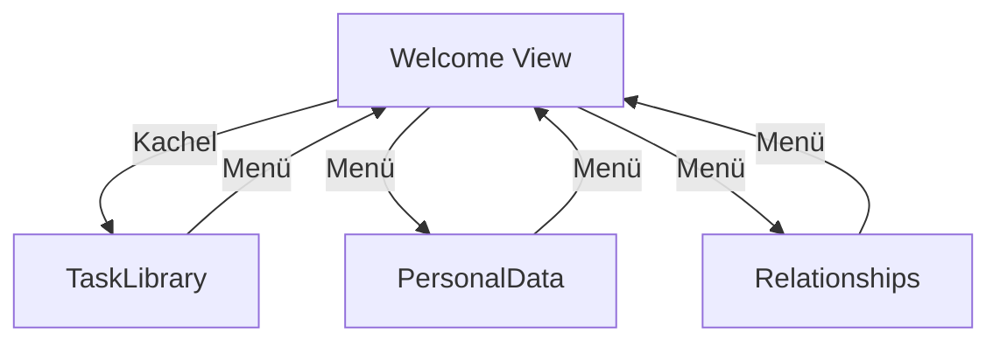

# My Life - Ansichten wechseln

Über das **Views**-Menü (3x3 Punkte) in der oberen rechten Ecke können Sie jederzeit zwischen den verschiedenen Funktionsbereichen der Applikation wechseln:

1.  **Welcome**: Zurück zu dieser Startseite.
2.  **TaskLibrary**: Der grafische Editor für Ihre Prozesse und Aufgabenketten.
3.  **PersonalData**: Hier verwalten Sie Ihre Stammdaten und persönlichen Informationen.
4.  **TimeManagement**: Planung von Terminen, Fristen und täglichen Abläufen.
5.  **Relationships**: Dokumentation und Pflege Ihres sozialen und beruflichen Netzwerks.

Jede Ansicht merkt sich ihren Zustand, solange die Applikation im Browser geöffnet bleibt. Beim Wechsel aus der TaskLibrary werden Sie gewarnt, falls noch ungespeicherte Änderungen vorliegen.

## Navigations-Übersicht

Hier ist eine Übersicht, wie Sie zwischen den verschiedenen Ansichten navigieren können:

